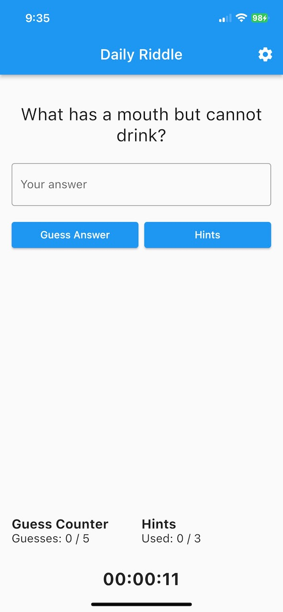
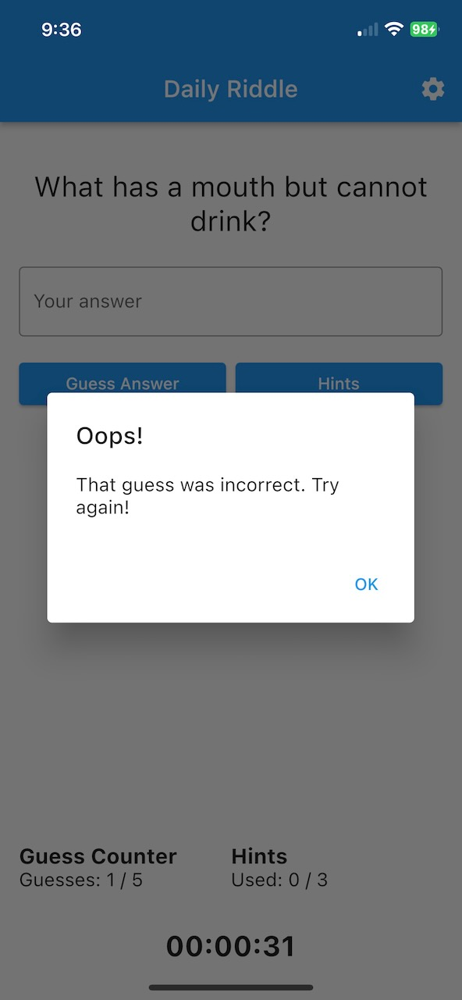
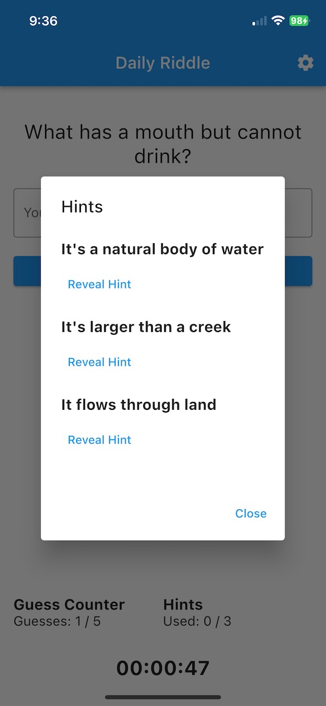
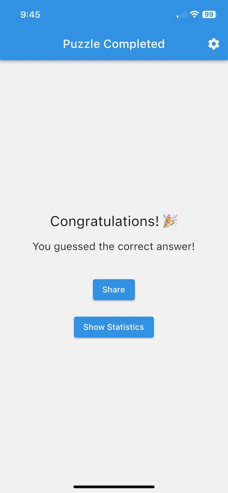
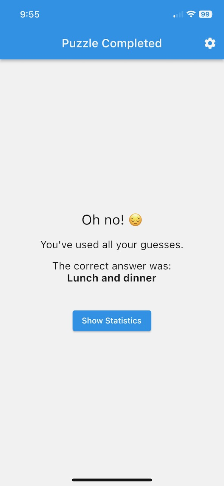
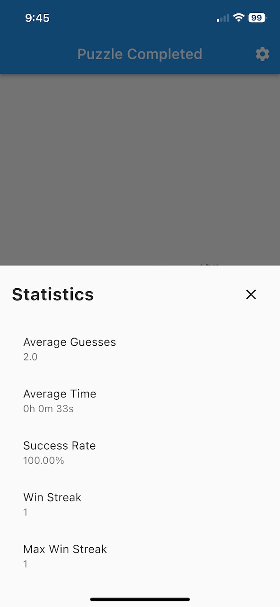
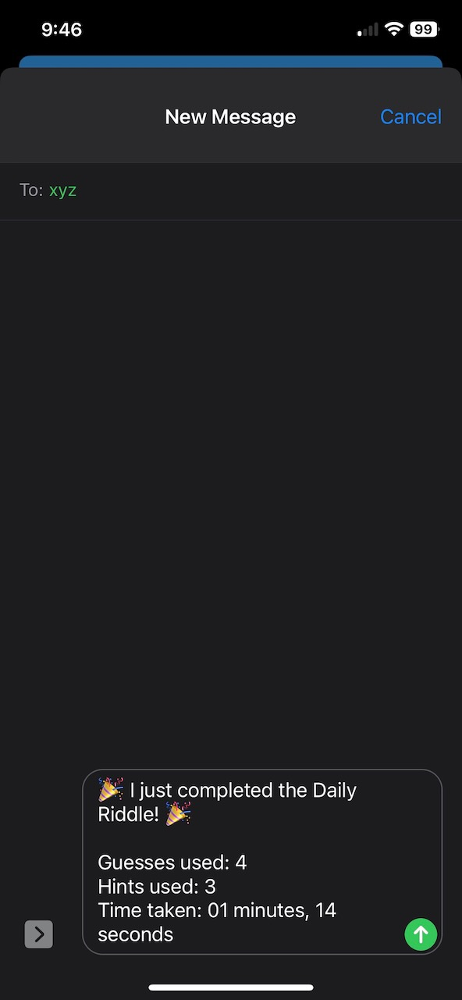

# Riddle Me This!

A daily riddle app, inspired by Wordle. This repository contains the mobile client for "Riddle Me This!".

## About

"Riddle Me This!" is a cross-platform mobile application built using Flutter. It connects to a dedicated server for fetching daily riddles. If you're interested in the server-side code, you can find it at [jbayntun/riddle_server](https://github.com/jbayntun/riddle_server).

## Setup and Installation

1. **Dependencies**: Before running the app, you'll need to install the necessary dependencies using:
    ```
    flutter pub get
    ```

2. **Environment Setup**: Create a `.env` file in the root directory of the project and add the following line:
    ```
    RIDDLE_API_SECRET=<MySecret>
    ```
    This token should match the one expected by the server.

3. **Running the App**: Once you've set up the environment, you can run the app in release mode using:
    ```
    flutter run --release
    ```

## Screenshots


The main game screen:


Uh oh, wrong guess:


Need a hint?


We have a winner!


Or not...


Some personal stats:


Share with friends: 



